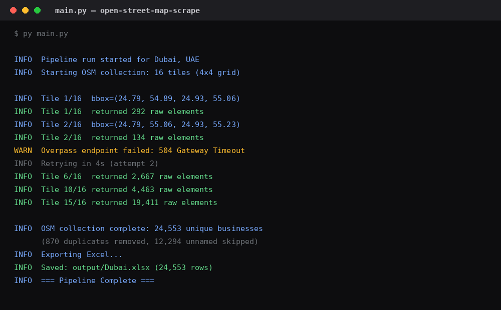
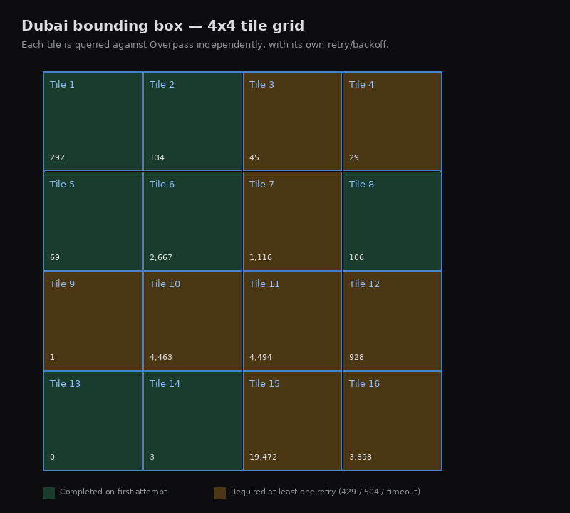
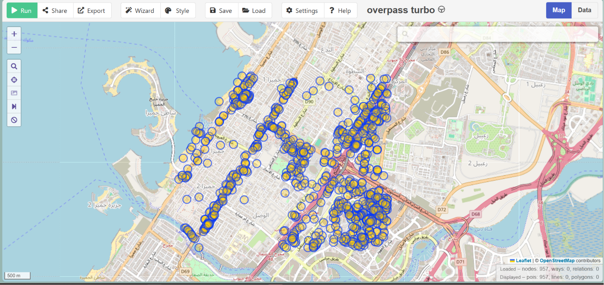
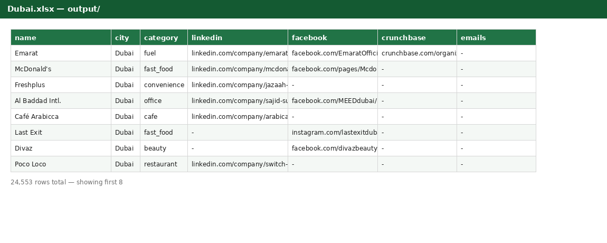

# open-street-map-scrape


A geofenced business discovery pipeline that queries OpenStreetMap's Overpass API, tiles large regions to work around public-server limits, retries failures with backoff across multiple mirrors, deduplicates results, and exports a clean Excel seed list.

---

## Table of Contents

- [Overview](#overview)
- [How It Works](#how-it-works)
- [Sample Output](#sample-output)
- [Features](#features)
- [Project Structure](#project-structure)
- [Installation](#installation)
- [Usage](#usage)
- [Configuration](#configuration)
- [Limitations](#limitations)
- [Roadmap](#roadmap)
- [Links](#links)
- [License](#license)

---

## Overview

Give it a bounding box, get back every named business inside it — shops, offices, cafes, clinics, workshops — with category, coordinates, address, website, and phone where OpenStreetMap has them tagged.

Built as a modular framework, not a one-off script: new collectors can be added without touching the core pipeline, and scaling from one city to a whole region is a config change, not a code change.

<p align="center">
  
</p>

---

## How It Works

Overpass's public servers gateway-time-out on large single-city queries, so the pipeline splits the target bounding box into a grid and queries each tile independently.

<p align="center">
  
</p>

<p align="center">
  
  <br/>
  <sub>Raw Overpass query results for a section of Dubai — before deduplication and filtering. Captured via <a href="https://overpass-turbo.eu">Overpass Turbo</a>.</sub>
</p>

| Step | What happens |
|---|---|
| 1. Tile | Bounding box split into an N×N grid, each tile queried separately |
| 2. Retry | Each tile retries the same Overpass endpoint with exponential backoff before falling through to a mirror |
| 3. Parse | Raw OSM elements converted to a normalized `Business` record |
| 4. Deduplicate | Same business appearing as multiple OSM elements (node + way) collapsed on name + coordinates, or matching website/phone |
| 5. Export | Clean list written to Excel |

---

## Sample Output

<p align="center">
  
</p>

---

## Features

| Feature | Detail |
|---|---|
| **Tiled collection** | Configurable grid size, avoids Overpass timeout on large regions |
| **Retry with backoff** | Per-endpoint retries before falling through to the next mirror |
| **Multi-mirror fallback** | Multiple public Overpass endpoints configured, tried in order |
| **Deduplication** | Name + coordinate matching, and website/phone matching |
| **Excel export** | One clean spreadsheet per run, fixed column schema |
| **Config-driven scaling** | New geofences added by editing `config.py`, no code changes |

---

## Project Structure

```
config.py          all constants — geofences, endpoints, retry/backoff tuning
main.py             orchestrates: collect -> export
collectors/
  osm.py            Overpass collector: tiling, retries, parsing, dedup
models/
  business.py       the Business dataclass every collector returns
exporters/
  excel.py           Business objects -> final .xlsx
utils/
  logger.py          shared logging setup
data/                raw/processed data (gitignored)
output/               generated Excel files
```

---

## Installation

```bash
git clone https://github.com/YOUR_USERNAME/open-street-map-scrape.git
cd open-street-map-scrape
pip install -r requirements.txt
```

---

## Usage

Set a target area in `config.py`:

```python
GEOFENCES = {
    "dubai": {
        "label": "Dubai, UAE",
        "bbox": (24.7921, 54.8951, 25.3574, 55.5651),  # south, west, north, east
    },
}
ACTIVE_GEOFENCE = "dubai"
```

Run:

```bash
py main.py
```

Output: `output/<geofence>.xlsx`. Logs: console + `logs/pipeline.log`.

---

## Configuration

| Setting | Controls |
|---|---|
| `GEOFENCES` | Named bounding boxes — add a region by adding one entry |
| `OSM_GRID_ROWS` / `OSM_GRID_COLS` | Tile grid density |
| `OSM_BUSINESS_TAG_KEYS` | OSM tags counted as a business (`shop`, `office`, `craft`, `amenity`) |
| `OVERPASS_ENDPOINTS` | Mirror list, tried in order |
| `OVERPASS_RETRIES_PER_ENDPOINT` / `OVERPASS_BACKOFF_BASE_SECONDS` | Retry behavior |
| `OSM_TILE_DELAY_SECONDS` | Pause between tile requests |

---

## Limitations

| Limitation | Detail |
|---|---|
| **Coverage tied to OSM data quality** | Untagged businesses won't appear — this is discovery, not a registry |
| **No verified registration status** | Confirms operating presence, not legal/trade license standing |
| **No SLA on public mirrors** | Runtime varies with Overpass server load at the time |

---

## Roadmap

- [ ] Additional collectors feeding the same `Business` schema
- [ ] Cross-source deduplication once multiple collectors are active
- [ ] Confidence scoring as independent sources confirm the same business

---

## Links

- [OpenStreetMap](https://www.openstreetmap.org)
- [Overpass API](https://wiki.openstreetmap.org/wiki/Overpass_API)
- [Overpass QL reference](https://wiki.openstreetmap.org/wiki/Overpass_API/Overpass_QL)
- [Overpass Turbo](https://overpass-turbo.eu)

---

## License

MIT — see `LICENSE`.